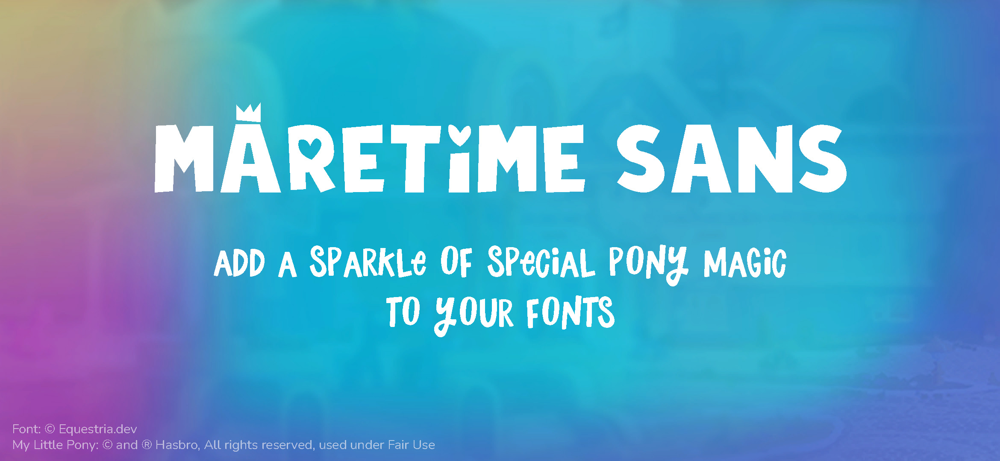
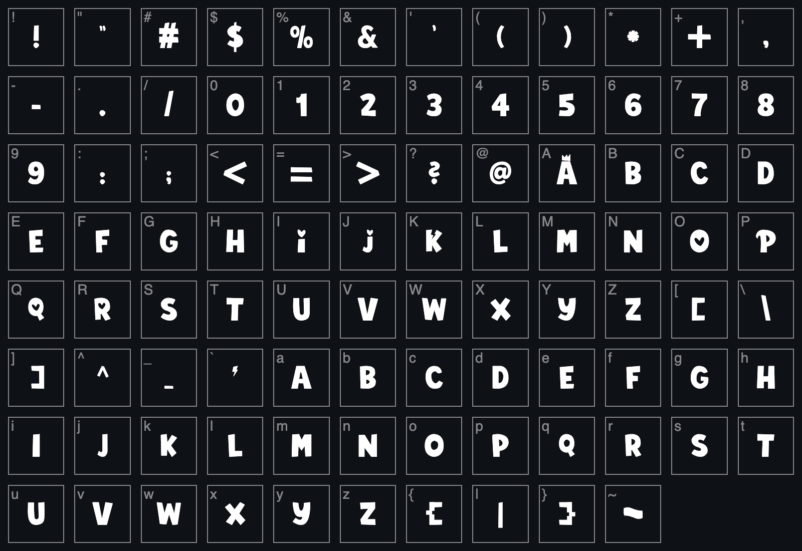

# 


Maretime Sans is a font based on the 2022 My Little Pony logo. It is built on a re-creation of the text found in various Hasbro marketing material.

## Currently available characters


## Overview

### Maretime Sans is...
* A childish-looking font
* A font to show your appreciation towards My Little Pony
* A font to represent everypony
* A cool font to use for your titles

### Maretime Sans is not...
* **An official Hasbro asset or product**
* A font to use for paragraphs of text
* A font to use for non-title headings
* A font to recreate official Hasbro artwork

## Installation

The font will appear as `MLPMaretimeSans` once installed on a system, so it can go along with the Find Your Sparkle* (`MLPFindYourSparkle`) font.

**Find Your Sparkle is an official proprietary font made by Hasbro and is not provided in this repository.*

### Windows
* [Download the font](./export.otf)
* In Windows Explorer, right click it
* Click on "Install" or "Install for all users" (depending on what you want)

### macOS
* [Download the font](./export.otf)
* Open the Font Book app
* Drag-and-drop the downloaded file to the Font Book app

### Linux (GNOME/Ubuntu)
* [Download the font](./export.otf)
* Open the downloaded file with the Fonts application
* Click on "Install" in the top right corner

### Linux (KDE Plasma)
* [Download the font](./export.otf)
* Open System Settings, and go to the Fonts page
* Go to "Personal Fonts" (or "System Fonts" if you want to install it system-wide)
* Click on "Install from File..." and select the downloaded file

### CSS
* [Download the font](./export.otf) to your website (here, it is assumed to be `/assets/font.otf`)
* Add the following CSS code:
```css
@font-face {
    src: url("/assets/font.otf");
    font-family: "MLPMaretimeSans";
    font-style: normal;
    font-weight: normal;
}
```
* Now, you can use the following rule: `font-family: "MLPMaretimeSans", sans-serif;`

## License
The assets used in this font are inspired by Hasbro's assets for My Little Pony, therefore, they fall into Fair Use. However, using this font to infringe on Hasbro's trademark(s) is considered counterfeit and is illegal.

As for the font itself, you can use it freely for all your hobby projects and not-for-profit projects; however, please avoid using it in commercial settings. Also avoid claiming it as your own or removing copyright notices in the font file.

## Troubleshooting
If you encounter an issue with this font, uninstall it and reinstall it. If the issue persists, [contact the developers](https://equestria.dev/contact).

## Get involved
If you want to add new characters to the font, report/fix issues, or just about anything, please create an issue on this repository.
